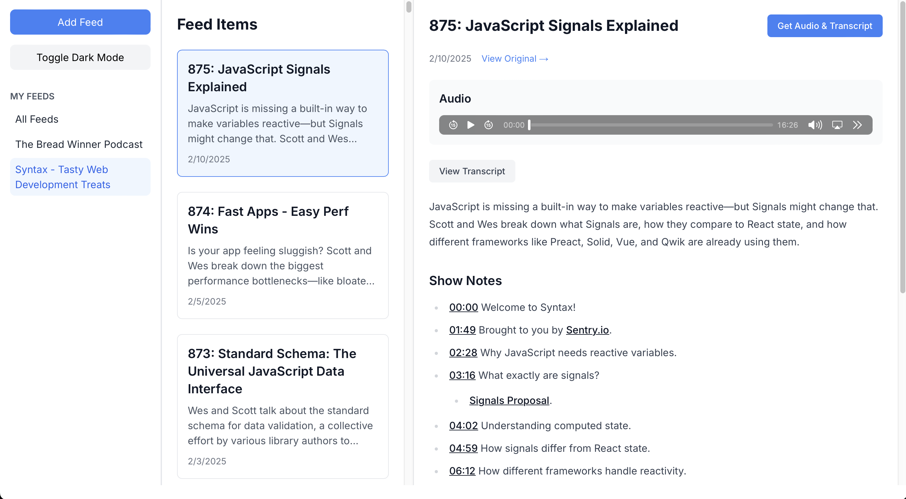

# RSS Feed

## Technologies used

- Built with Cursor
- React with Next.js 14 App Router
- TailwindCSS
- Firebase Auth, Storage, and Database

## Prerequisites

- Node.js
- npm

## Installation

```bash
npm install
```

## Available Scripts

- `npm run dev` - Starts development server
- `npm run build` - Creates production build
- `npm run start` - Runs production server
- `npm run lint` - Runs ESLint for code quality

## Development

The project uses TypeScript and includes configurations for:

- ESLint
- Tailwind CSS with Typography plugin
- Next.js-specific optimizations

## Notes
A quick way to find RSS feeds to add to the app for testing:
(https://castos.com/tools/find-podcast-rss-feed/)

## Version

Current version: 0.1.0

## Demo Image


